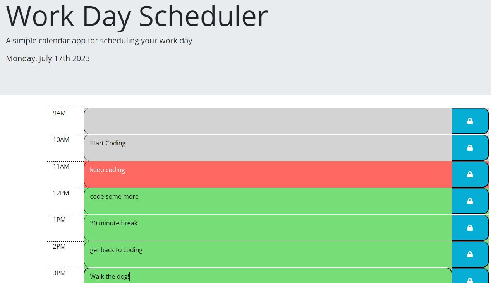

# Work Day Scheduler

A simple web app uses localStorage and dayJS to keep track of a single day's tasks

## Authors

- [@ghaworth1](https://www.github.com/ghaworth1)

## Links

[Live link](https://ghaworth1.github.io/dayjs-scheduler/)

## Screenshots

## License

[MIT](https://choosealicense.com/licenses/mit/)
